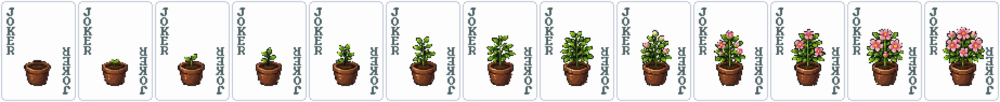

# Coolatro Mod

**A Vanilla-adjacent mod with cool jokers to experiment with!**

If you want to keep vanilla experience, but want to try out new strategies this mod is for you!

Try out playing different hand combinations and try to turn downsides into powerful strenghts in your deck!

For now this mod gives 30 jokers:
- 16 Common Jokers
- 10 Uncommon Jokers
- 3 Rare Jokers

This mod is balanced around vanilla power level, most of the jokers can eaisly be built around for endless mode.

## Side notes

This mod requires **Steammodded** first, install it to progress.

Feel free to report any bugs or balance changes proposals!

## List of jokers

| Joker | Description |
|-------|-------------|
|  | +#2# Mult if played hand has equal number of black and red cards (Currently +#1# Mult) |
|  | Create Etheral Tag after Shop is left with no purchases |
|  | Create Double Tag after Blind is skipped |
|  | X#1# Mult if no face cards held in hand |
|  | Shop contains only Tarot cards |
|  | Every played Mult card permamently gains +#1# Mult when scored |
|  | When Boss Blind is selected, gain +#1# hands |
|  | +#2# discard next round per reroll in the shop (Currently +#1# discards) |
|  | X#1# Mult, Shop items cost $#2# more |
|  | Has double Chips and Mult of base poker hand, Play a #3# for it to grow (Currently +#1# Chips and +#2# Mult) |
|  | Numbered cards gain a random seal when added to a deck |
|  | Sell this to add Foil, Holographic or Polychrome edition to cards in your deck, +#2# cards per round played (Currently #1# cards) |
|  | #3# in #4# chance for discarded #1#s to create a Tarot card, #2#s to create a Planet card, ranks change every round (Must have room) |
|  | Increase lowest rank of scored cards by 1 |
|  | Increase sell value by Chips (maximum $20) of cards opened from Standard packs |
|  | +#1# Chips per unique Enchancement on scored or held cards |
|  | Stone Cards trigger #1# additional times |
|  | If played hand is #3# this gains X#2# Mult and changes suit of played hand (Currently X#1# Mult) |
|  | If played hand is a #3# scored numbered cards have a #1# in #2# chance to become Steel Cards |
|  | Planets used to upgrade lowest-level poker hand, create Trance spectral card (Must have room) |
|  | If 2-4 scoring Hearts cards, sacrifice random one and gain its Chips (Currently +#1# Chips) |
|  | If 2-4 scoring Diamonds cards, +$#2# to payout and earn it, resets each Ante (Currently $#1#) |
|  | If 2-4 scoring Clubs cards, double propabilities until next Blind is selected (Currently X#1#) |
|  | If 2-4 scoring Spades cards, after #2# times gain a Voucher Tag and $#3# (Currently #1#/#2#) |
|  | Scored 7s have #1# in #2# chance to add Foil, Holographic or Polychrome edition to a random Joker |
|  | X#1# Mult per card type in consumable area |
|  | Shuffle all Enchanced cards at top of the deck for the next #1# rounds |
|  | Contents of all Booster Packs have #1# in #2# chance to be a Legendary Joker |
|  | At the end of round transform non-legendary Joker to the right to another one of the same rarity |
|  | During Blind trigger thrice 2 jokers to the right, debuff other jokers, direction swaps each hand (Jokers fixed after Blind is selected) |
